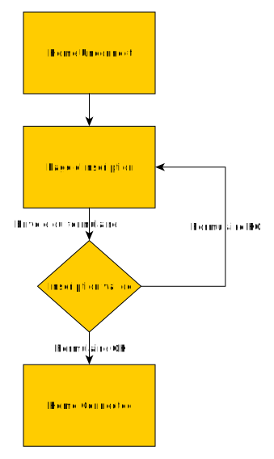
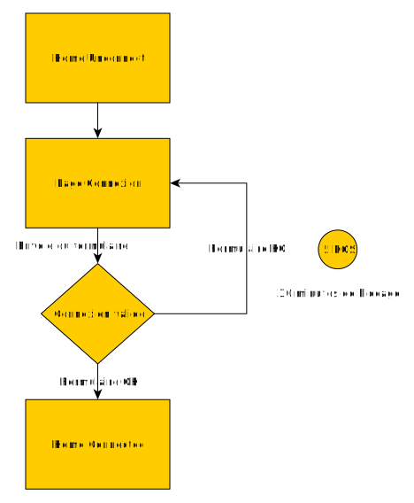
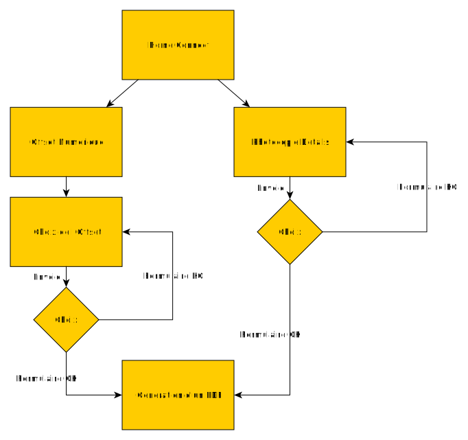

# Expression du besoin : Module "Impression en ligne"

## Contact
Client : Maison de la copie
Interlocuteur : Erwan
Version : 0.1.3
Date de version : 2 Novembre 2017
Formateur référent : Erwann Duclos

+ Formateur : Erwann DUCLOS : e.duclos@fondationface.org
+ Apprenant : Romain SEITE : saromase@saromase.fr
+ Client : Erwan : contact@maison-copie.fr

## Contexte

### Commanditaire
La maison de la copie est une entreprise locale, dont l'activité principale est la reprographie pour les particuliers ainsi que pour les professionnels.

### Contraintes
La réalisation de ce module doit être finie d'ici le 22 Janvier 2018, date à laquelle la formation prend fin.
Le site devra pouvoir accepter le multi-langue. Il est attendu en solution finale d'avoir une application bretonne (première langue) et française (deuxième langue).

## Partie publique

## Architecture :

Page de connexion/inscription

Photocopie détail

Offset Numérique

Devis

Upload Files

### Page de connexion/inscription
Le client souhaiterait avoir une unique page, ou l'utilisateur pourrait choisir de se connecter ou de s'inscrire. Le style devra ressembler au réseau social Tumblr : [Tumblr](https://www.tumblr.com).

Dans le cas de la connexion, lorsque l'utilisateur se trompe cinq fois, l'application lui refuse toute nouvelle connexion durant les 30 minutes suivantes.

Un compte utilisateur contiendra les informations suivantes  :

- Coordonnées

	* Statut (option - Particulier/Association/Entreprise/Administration/Etudiant - required )
	* Nom / Raison Social ( string - 50 char - required )
	* Adresse ( string - 100 char )
	* Complement d'adresse ( string - 100 char)
	* Ville ( string - 50 char )
	* Code Postal ( integer - 5 char )
	* Email (string - 100 char - required )
	* Civilite ( option - Mr/Mme )

- Informations Complémentaires

	* Nom ( string - 50 char )
	* Prénom ( string - 50 char )
	* Fonction dans l'organisation ( string - 50 char )
	* Information complémentaire ( string - 255 char )

### Photocopie détail
L'utilisateur pourra choisir l'ensemble des caractéristiques d'impression souhaiter, cela lui générera un devis automatiquement calculer en fonction des coûts, des marges, et du statuts du client.
[TO Define]
Téléchargement du fichier PDF pour l'utilisateur, ainsi que son stockage en BDD

### Offset Numérique
L'utilisateur aura le choix avec des packs pré fait, coûtant moins chère, et générant un devis rapide
[TO Define]
Téléchargement du fichier PDF pour l'utilisateur, ainsi que son stockage en BDD

### Upload file
Suite à l'élaboration du devis, il sera possible d'uploader les fichiers afin de pouvoir préparer l'impression plus rapidement.
[TO Define]

### Use cases
[TO DO]

[TO Define]

## Planning

## Maintenance
Aucune garantie de maintenance ne peut être fournie dans le cadre de la code académie.

### Responsive
Le site sera adapté à la consultation sur smartphone, tablette ainsi que desktop. C'est à dire, qu'il s'adaptera pour des tailles d'écran allant de 320px à 1920px de largeur.

### Compatibilité navigateurs

Cette application se devra d'être compatible avec la majorités des navigateurs internet courants. Il est attendu d'avoir une application compatible avec les version de navigateurs suivantes :

 * Google Chrome 59+

 * Mozilla Firefox 54+

 * IE11

 * Edge 14+

 * Safari 10+

 * Opera 46+

### Référencement
La maison de la copie s'occupera du référencement. Le site répondra aux bonnes pratiques de référencement néanmoins. Ainsi il sera sécurisé et respectera mes normes W3C.

### Charte graphique
Le client fournit la charte graphique. Dans l'attente de la charte graphique, un style sobre et épuré sera mis en place.

### Mention légales
Le client prend connaissance de l'obligation de figuration des mentions légales présentes dans le site web. Dans l'attente de la réception des mentions légales, la page sera créée mais ne contiendra aucune information.

### Textes
Le client fournira l'ensemble des traductions pour les champs affichés au sein du site internet.

# Questions :
## Inscription
- Le mot de passe est-il choisit par l'utilisateur ?

## Offset Numérique & Photocopie détails
- Quels sont les champs nécessaire pour chaque devis ?

## Upload de fichier
- Quels sont les differents format d'envoie de fichier autorisé ?
- Stockage permanents ou uniquement temporaire ?
- Quel taille de fichier maximum ?
- Dans les options pour la création d'un compte, il est conseillé de rajouter le genre : "Autre" en plus de Mr et Mme.
- souhaitez-vous avoir une complétion automatique du champ ville, après la saisie du code postal, ou directement via l'adresse ? 
